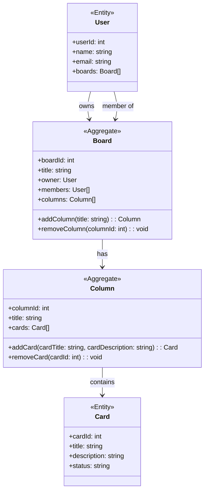
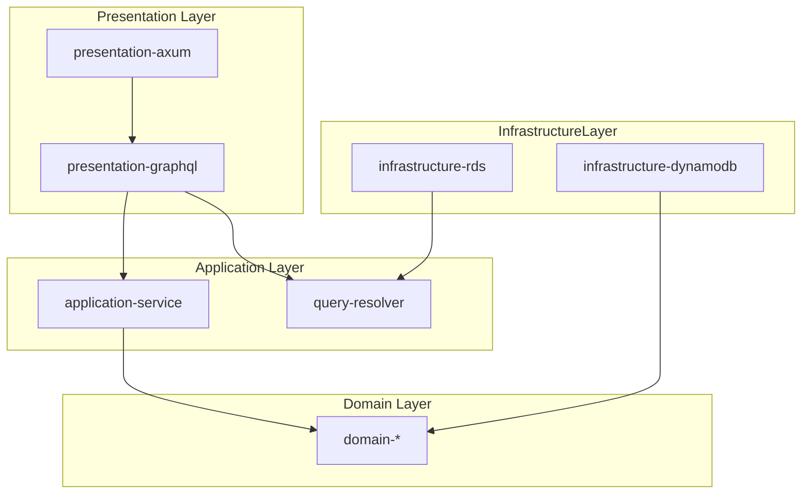

# run
```
cargo run
```

access `localhost:8000`

## with watch
```
cargo watch -x run
```

# Domain

```mermaid
classDiagram
    class User {
        <<Entity>>
        +userId: int
        +name: string
        +email: string
        +boards: Board[]
    }

    class Board {
        <<Aggregate>>
        +boardId: int
        +title: string
        +owner: User
        +members: User[]
        +columns: Column[]
        +addColumn(title: string): Column
        +removeColumn(columnId: int): void
    }

    class Column {
        <<Aggregate>>
        +columnId: int
        +title: string
        +cards: Card[]
        +addCard(cardTitle: string, cardDescription: string): Card
        +removeCard(cardId: int): void
    }

    class Card {
        <<Entity>>
        +cardId: int
        +title: string
        +description: string
        +status: string
    }

    User --> Board : owns
    User --> Board : member of
    Board --> Column : has
    Column --> Card : contains
```

# Layer

```mermaid
graph TD

subgraph Domain Layer
    A[domain-*]
end

subgraph Application Layer
    C[application-service] --> A
    D[query-resolver]
end

subgraph InfrastructureLayer
    E[infrastructure-rds] --> D
    H[infrastructure-dynamodb] --> A
end

subgraph Presentation Layer
    F[presentation-graphql] --> C
    F --> D
    G[presentation-axum] --> F
end
```
