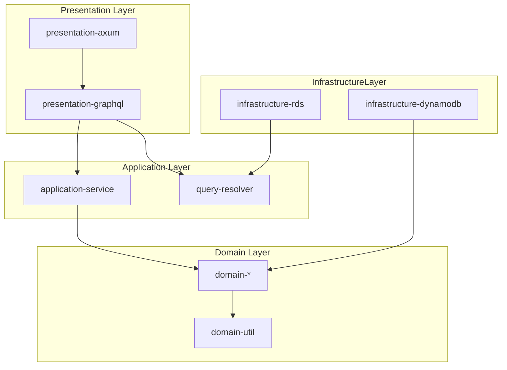

# scripts

## requirements
### install commands
```
cargo install sqlx-cli
```

### environment variable
```
cargo run --package scripts --bin gen_schema
```

### docker
```
docker compose up -d
```

## run
```
cargo run
```

access `localhost:8000`


## with watch
```
cargo watch -x run
```


## migrate
```
# add
sqlx migrate add "create table users"
# run
sqlx migrate run
```

SEE: https://github.com/launchbadge/sqlx/blob/main/sqlx-cli/README.md

## scripts
```
# graphql shcema generation
cargo run --package scripts --bin gen_schema
# add data
cargo run --package scripts --bin sample_data
```


# Domain


# Layer

